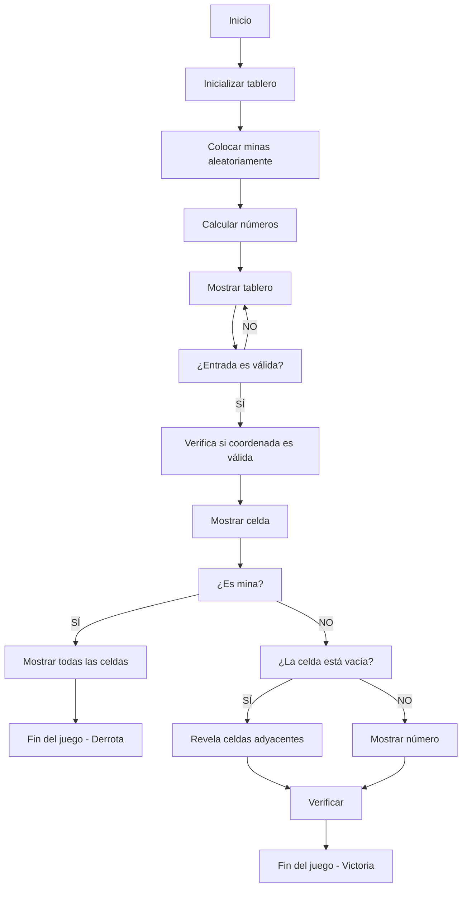

# Proyecto-Buscaminas

```mermaid
flowchart TD
    A[Inicio] --> B[Inicializar tablero]
    B --> C[Colocar minas aleatoriamente]
    C --> D[Calcular números]
    D --> E[Mostrar tablero]
    E --> F[¿Entrada es válida?]
    F -- NO --> E
    F -- SÍ --> G[Verifica si coordenada es válida]
    G --> H[Mostrar celda]
    H --> I[¿Es mina?]
    I -- SÍ --> J[Mostrar todas las celdas]
    J --> K[Fin del juego - Derrota]
    I -- NO --> L[¿La celda está vacía?]
    L -- SÍ --> M[Revela celdas adyacentes]
    M --> N[Verificar]
    N --> O[Fin del juego - Victoria]
    L -- NO --> P[Mostrar número]
    P --> N
```
